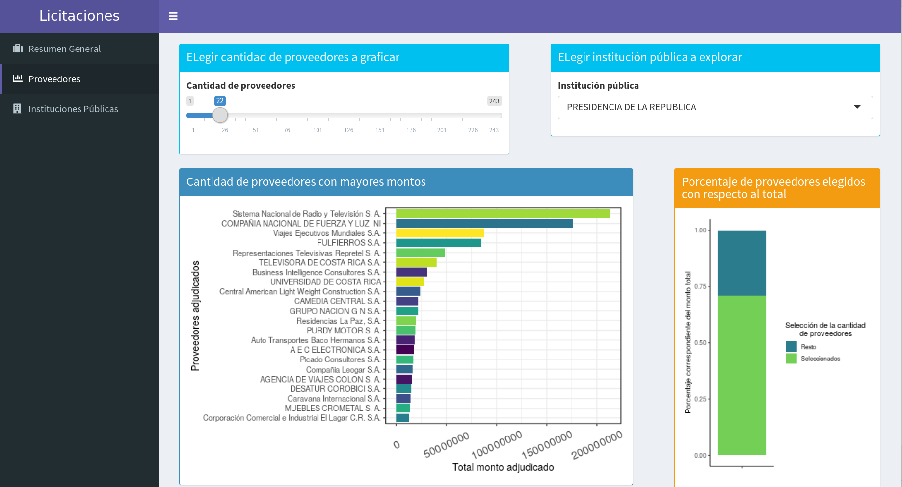

# app_licitaciones
Aplicación en Shiny con datos de **Licitaciones Adjudicadas 2014-2015** del gobierno de CR.

# Descripción
El dashboard pretende dar interactividad ante el usuario que le permita hacer una exploración con los datos disponibles y obtenidos a través de API del [Gobierno Abierto de Costa Rica](http://datosabiertos.presidencia.go.cr/home).

El dashboard muestra secciones como las siguientes:

Estas secciones permiten explorar y responder preguntas cómo:

- ¿Cuántos proveedores por determinada institución, recibieron una adjudicación?
- ¿Cúales instituciones han tenido mayor cantidad de licitaciones adjudicadas?
- ¿Cuáles son los mayores proveedores con licitaciones adjudicadas por institución pública?
- ¿Cuánto ha sido el monto otorgado a proveedores por licitaciones adjudicadas?

# Getting started

## Instalación

## Uso

## Contribuir

## Obteniendo ayuda

# Autores

# Agradecimientos
